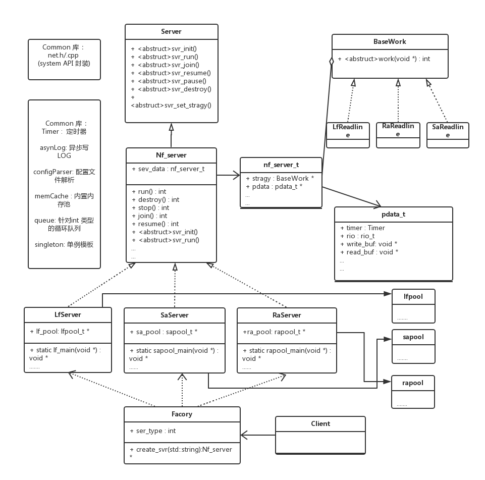

NF_SERVER  (轻量级网络服务编程框架)
===================================  

支持操作:
-----------------------------------  

TCP  IPV4通信，全部基于线程操作，提升为实时进程调度，需要root权限运行。

框架架构:
-----------------------------------  

支持模式: 
-----------------------------------  

### 线程模型 leader-follower (lfpool.cpp)

      （1）每线程管理一个连接，适用与短链接、快速连接
      
      （2）采用超时 + 阻塞 进行读写

### Half reactor/Half sync 模型 (sapool.h)

      (1) main 线程负责启动所有工作线程，启动成功后负责监听外部发送的信号。

      (2) 一个reactor 线程负责监听连接池里所有连接及等待连接的socket
      
         1. 若等待连接socket有事件发生，则注册该socket 到连接池中，置READY状态。
         2. 若连接池中READY状态，则将连接注册到循环事件队列(common/queue.h)中，置BUSY状态。清理发生状态fd的监控。
         
      (3)worker 线程负责从循环事件队列中获取事件，执行相应操作。结束后，连接池中状态置READY，回设
         监听reactor  对该fd 的监控

     （4）非阻塞读，阻塞+超时写。 内存池管理非阻塞读时，需要保持状态的数据。
      
     （5）比较均衡的模式，长短连接、CPU频繁、IO频繁操作均可使用

### Reactor + 多线程模型 (rapool.h)

       (1) main 线程负责启动所有工作线程，启动成功后负责监听外部发送的信号。

       (2)一个reactor 线程负责监等待连接的socket, 若监听socket 有事件发生，则accept，并执行： 
      
         1. 注册该socket 到连接池中，置BUSY状态。
         2. 负载均衡，将该socket 注册到一个压力较小的子reactor。

      （3）其余worker线程为子reactor， 每一个子reactor 维护监听 reactor注册过来的事件。

      （4）全程非阻塞读写，不会发生等待现象，最大限度利用CPU。 内存池管理非阻塞读，写时，需要保持状态的数据
      
      （5）适用于IO频繁操作。注册运行的回调函数时，主要不要有阻塞，等待操作。 

框架使用：
-----------------------------------  

### 目的

      （1）托管与client端的连接管理、内存管理、数据的读取和发送， LOG读写等。
      
      （2）应用方只需要设置回调函数，从指定内存中读数据，业务处理，存储数据到发送内存中。
          框架自动进行读写。
  
### simple echo example        
      void
      nf_default_handle()
      {
           char * read_buf = (char *) nf_server_get_read_buf();
           char * write_buf = (char *) nf_server_get_write_buf();
           
           
           int readed_size = nf_server_get_readed_size();
           strncpy(write_buf, read_buf, readed_size);
           
           //Log :: NOTICE("CALL BACK READ DATA %d", readed_size);
           
           nf_server_set_writed_size(readed_size);
           nf_server_set_writed_start(readed_size);
      }
      

架构基本功能：
-----------------------------------  
### 内存管理 (common/memCache.h）

      （1）静态内存：初始化SVR 时候统一创立，SVR结束时统一销毁。运行过程中循环利用，
                   主要用于线程的读/写 工作缓存区
            
      （2）动态内存： 内存池进行统一的管理、维护。在框架中，主要用于存储读/写cache
                    存储。

### 日志管理(common/asynLog.h)

      （1） 支持 NOTICE， DEBUG，WARN, ERROR 四种模式
            
      （2） 采用异步日志框架。
            
### 配置文件管理(common/configParser.h)

      （1） 日志解析类， 支持格式
            [session]
            key=value
            #注释
      
### 定时器管理(common/timer.h)

      (1) 使用红黑树 (map）管理定时器，支持毫秒级别定时
     
     （2) add_timer_ms(time,  函数指针，(void *)args)

### 调度管理

      （1） 线程使用启用 FIFO模式调度。
      
      （2） 支持线程优先级设置，默认: Listen 线程优先级为10 ，Work 线程优先级为5。 

### 框架扩充

      （1）整体架构基于pool_register.h 进行扩充，采用struct + 函数指针 模拟多态。
      
      （2）扩充方法： 填充 g_pool[] 中对应的函数指针， 并将函数实现放在新的 *pool.h/*pool.cpp

